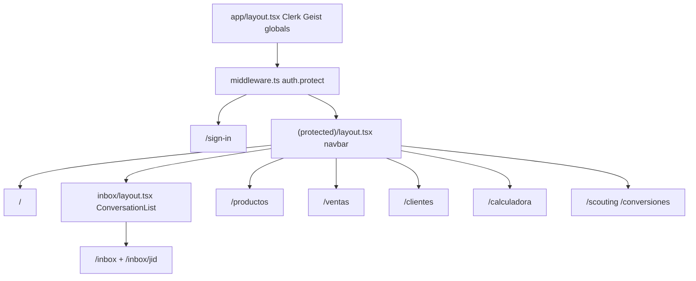

# fastseller_dashboard — Resumen como base de tema

Documento de referencia **UI** del dashboard. Package manager: **pnpm** (no npm). Ver `memory/feedback_package_manager.md`.

**Monorepo (backend + contrato + deudas):** [`docs/PROJECT_OVERVIEW.md`](../docs/PROJECT_OVERVIEW.md) — fuente de verdad para análisis LLM.  
Al cambiar rutas, auth, contrato inbox o env, actualizar este archivo **y** el overview (regla `.cursor/rules/keep-project-docs-updated.mdc`).

---

## Identidad

| Item | Valor |
|------|--------|
| Stack | Next.js 15 App Router + React 19 + TypeScript |
| Producto | Dashboard VictoriaLeads (inbox + productos/inventario + ventas + reportes + calculadora) |
| Features | `/` (home métricas), `/inbox`, `/inbox/[jid]`, `/productos`, `/ventas` (+ `/nueva`, `/[id]/editar`), `/clientes`, `/reportes` (+ `/ventas`, `/kardex`, `/movimientos`), `/conversiones` (compra USDT multi-venta), `/calculadora` |
| Placeholders | `/scouting` |

---

## Stack y dependencias

| Paquete | Rol |
|---------|-----|
| `@clerk/nextjs` | Auth |
| `tailwindcss` ^4 + `@tailwindcss/postcss` | Estilos |
| `shadcn` + `@base-ui/react` | Primitivos UI (`base-nova`) |
| `class-variance-authority`, `clsx`, `tailwind-merge` | Variantes + `cn()` |
| `lucide-react` | Iconos |
| `react-hot-toast` | Toasts |
| `socket.io-client` | Realtime hacia el bot |
| `tw-animate-css` | Animaciones |
| `vitest` | Tests del motor de calculadora |
| `zustand` | Declarado pero **no usado** |

Scripts: `dev`, `build`, `start`, `lint`, `test`.

---

## Tema (preservar como base)

### Capa design system

| Archivo / carpeta | Qué aporta |
|-------------------|------------|
| `app/globals.css` | Tailwind 4, tokens oklch, `@theme inline`, dark preparado pero inactivo |
| `components.json` | Config shadcn `base-nova` |
| `components/ui/*` | Primitivos shadcn (incl. Card, Alert) |
| `lib/utils.ts` | `cn()` = `twMerge(clsx(...))` |
| `app/layout.tsx` | Geist + Geist Mono, `ClerkProvider`, `ToastProvider` |
| `postcss.config.mjs` | Plugin `@tailwindcss/postcss` |

Dark mode: tokens existen; **no hay** toggle. Light only.

### Piel visual

- Shell: `bg-gray-50`, blanco, `border-gray-200`
- Acento violet: `violet-500/600/700`
- Chat: fondo `#f9fafb`; bot `#dcfce7` / `#15803d`
- Layout protegido: navbar en `(protected)/layout.tsx`; ConversationList solo en `inbox/layout.tsx`

---

## Auth y rutas

### Auth (Clerk)

- `ClerkProvider` en `app/layout.tsx`
- `middleware.ts`: `auth.protect()` en todo excepto `/sign-in(.*)` (incluye `/api/*`)
- Sign-in: `app/sign-in/[[...sign-in]]/page.tsx`
- Token hacia el bot: `useAuth().getToken()` → Bearer / socket. El session JWT debe traer claims `firstName` / `lastName` / `primaryEmail` (Clerk Dashboard → Sessions → Customize) para `agentName` en el backend sin `getUser`

### Rutas

| Ruta | Archivo | Notas |
|------|---------|-------|
| `/` | `app/(protected)/page.tsx` | Home métricas (`GET /metrics/summary`); chip brecha BCV↔Binance (`GET /rates` → `/calculadora`); tabs Hoy/Semana/Mes/Todo |
| `/sign-in` | `app/sign-in/[[...sign-in]]/page.tsx` | Pública |
| `/inbox` | `app/(protected)/inbox/page.tsx` | Lista / empty state |
| `/inbox/[jid]` | `app/(protected)/inbox/[jid]/page.tsx` | `ChatWindow` |
| `/productos` | `app/(protected)/productos/page.tsx` | CRUD catálogo + inventario; columna costo `purchasePriceUsd` |
| `/ventas` | `app/(protected)/ventas/page.tsx` | Lista + CxC; `?status=PENDIENTE\|PAGADA\|ANULADA`; filtro de entrega; ganancia bruta |
| `/ventas/nueva` | `app/(protected)/ventas/nueva/page.tsx` | Crear venta |
| `/ventas/[id]` | `app/(protected)/ventas/[id]/page.tsx` | Detalle + pagos + editar/anular |
| `/ventas/[id]/editar` | `app/(protected)/ventas/[id]/editar/page.tsx` | Editar venta (`SaleForm`) |
| `/clientes` | `app/(protected)/clientes/page.tsx` | Listado + búsqueda + crear/editar (nav desktop) |
| `/reportes` | `app/(protected)/reportes/page.tsx` | Redirect → `/reportes/ventas`; `layout.tsx` con tabs |
| `/reportes/ventas` | `app/(protected)/reportes/ventas/page.tsx` | Reporte de ventas por rango + filtros estado/entrega + totales + CSV |
| `/reportes/kardex` | `app/(protected)/reportes/kardex/page.tsx` | Kardex por producto/variante con saldo corrido + CSV |
| `/reportes/movimientos` | `app/(protected)/reportes/movimientos/page.tsx` | Ledger plano por producto (todas las variantes) + CSV; `?productId=` |
| `/calculadora` | `app/(protected)/calculadora/page.tsx` | ImportCalc VE (`GET /rates`) |
| `/whatsapp` | `app/(protected)/whatsapp/page.tsx` | Conexión del bot vía QR (`GET /whatsapp/status`, `POST /whatsapp/logout`, socket `bot_status`) |
| `/scouting` | `app/(protected)/scouting/page.tsx` | Stub |
| `/conversiones` | `app/(protected)/conversiones/page.tsx` | Compra de divisas (1 trade ↔ N ventas con Bs pendientes) |

### Env (ver `.env.example`)

| Variable | Uso |
|----------|-----|
| `NEXT_PUBLIC_CLERK_PUBLISHABLE_KEY` | Clerk client |
| `CLERK_SECRET_KEY` | Clerk server / middleware |
| `NEXT_PUBLIC_BOT_URL` | REST + Socket.IO (inbox, productos, ventas, tasas, métricas) |
| `NEXT_PUBLIC_CLERK_SIGN_IN_URL` | p.ej. `/sign-in` |
| `NEXT_PUBLIC_CLERK_AFTER_SIGN_IN_URL` | Post-login → `/` (home) |
| `NEXT_PUBLIC_CLERK_SIGN_IN_FORCE_REDIRECT_URL` | Force redirect → `/` |

---

## Arquitectura UI

### Módulo home (dashboard)

| Path | Rol |
|------|-----|
| `app/(protected)/page.tsx` | PeriodTabs + BrechaChip + MetricCards + widgets |
| `components/dashboard/PeriodTabs.tsx` | Hoy / Semana / Mes / Todo |
| `components/dashboard/BrechaChip.tsx` | Chip gap % → dropdown BCV/Binance/brecha + link `/calculadora` |
| `components/dashboard/MetricCard.tsx` | Número grande reusable |
| `components/dashboard/TopProducts.tsx` | #1 + top 5 con barras |
| `components/dashboard/SalesChart.tsx` | Barras por día (divs, sin chart lib) |
| `components/dashboard/LowStockAlert.tsx` | Alerta condicional → `/productos` |
| `lib/dashboard/period.ts` | `rangeForPeriod` → `from`/`to` ISO |
| `lib/api.ts` / `hooks/useApi.ts` | `getMetricsSummary` |
| `types/index.ts` | `MetricsSummary` |

### Módulo productos / inventario

| Path | Rol |
|------|-----|
| `app/(protected)/productos/page.tsx` | Lista + “Llegó mercancía” + dialogs |
| `components/productos/ProductTable.tsx` | Columna stock / lowStock / expand movimientos + link a `/reportes/movimientos` |
| `components/productos/ProductFormDialog.tsx` | Crear / editar (+ `minStock` + `purchasePriceUsd`) |
| `components/productos/StockMovementDialog.tsx` | ENTRADA/SALIDA/AJUSTE batch + confirmación |
| `components/productos/MovementHistory.tsx` | Tabla historial con badges por tipo |
| `components/productos/ProductTable.tsx` (stock) | Muestra **Disponible**; si hay reservas añade “N en físico · M comprometidas”; columna **Costo** |
| `components/productos/PriceInputs.tsx` | Niveles por `minQty` (REF_USD + REF_BS por fila) + Sugerir (`GET /rates`) + brecha % |
| `components/productos/VariantInputs.tsx` | Filas de variantes |
| `lib/api.ts` / `hooks/useApi.ts` | productos + stock/movements + `getRates` |
| `types/index.ts` | `Product*`, `Stock*`, `MovementType`, `PriceRef`, `ExchangeRates` |

Stock nunca se edita inline: solo vía movimientos. Sin página `/inventario` separada todavía.

Una venta sin entregar **reserva** stock en vez de descontarlo: `quantity` es el físico, `committed` lo reservado y `available = quantity − committed` es lo que se puede vender. `lowStock` (y la alerta del home) miran `available`.

### Módulo ventas

| Path | Rol |
|------|-----|
| `app/(protected)/ventas/page.tsx` | Lista + CxC; `?status=`; botón editar cliente por fila; ganancia bruta |
| `app/(protected)/ventas/nueva/page.tsx` | Wrapper `SaleForm` (crear) |
| `app/(protected)/ventas/[id]/page.tsx` | Detalle + pagos + editar/anular |
| `app/(protected)/ventas/[id]/editar/page.tsx` | Wrapper `SaleForm` (editar) |
| `components/ventas/SaleForm.tsx` | Crear / editar venta (`initialSale?`); precio unitario por línea + tiers |
| `components/ventas/CustomerPicker.tsx` | Búsqueda cédula/nombre + feedback loading/vacío |
| `components/ventas/CreateCustomerDialog.tsx` | Thin wrapper → `CustomerFormDialog` (create) |
| `components/ventas/PriceModeSelector.tsx` | REF_USD / REF_BS |
| `components/ventas/SaleLineItem.tsx` | Línea producto/variante/qty/precio editable |
| `components/ventas/PaymentDialog.tsx` | Registrar abono (+ comprobante opcional → WebP) |
| `components/ventas/PaymentTimeline.tsx` | Historial pagos (+ “Ver comprobante” en modal) |
| `components/ventas/ReceiptViewerDialog.tsx` | Modal de imagen firmada (pagos + compras USDT) |
| `components/ventas/DeliveryBadge.tsx` | Badge Por entregar / Entregada (lista + detalle) |
| `components/ventas/ReceivablesCard.tsx` | CxC en listado |
| `lib/ve/cedula.ts` / `lib/ve/phone.ts` | Normalización VE |
| `lib/ventas/money.ts` | Formatos + métodos de pago + `priceOf(qty)` / `qtyByProduct` |
| `lib/ventas/receiptImage.ts` | Conversión JPEG/PNG/WebP → WebP (canvas, calidad 80 %) |

### Módulo reportes

| Path | Rol |
|------|-----|
| `app/(protected)/reportes/layout.tsx` | Header + tabs Ventas / Kardex / Movimientos |
| `app/(protected)/reportes/page.tsx` | Redirect a `/reportes/ventas` |
| `app/(protected)/reportes/ventas/page.tsx` | Totales + tabla de ventas + por producto + CSV |
| `app/(protected)/reportes/kardex/page.tsx` | Selector producto/variante + tabla con saldo corrido + CSV |
| `app/(protected)/reportes/movimientos/page.tsx` | Selector producto + ledger plano (todas las variantes) + CSV |
| `components/reportes/ReportRange.tsx` | `PeriodTabs` + rango manual con `<input type="date">`; exporta `rangeQuery` / `rangeLabel` |
| `lib/reports/csv.ts` | `toCsv` / `downloadCsv` (BOM para Excel) / `csvDateTime` — sin librerías |

El rango manual manda sobre el tab de período; limpiarlo vuelve al tab.

### Módulo clientes

| Path | Rol |
|------|-----|
| `app/(protected)/clientes/page.tsx` | Listado + búsqueda + crear/editar |
| `components/clientes/CustomerFormDialog.tsx` | Create / edit (cédula, nombre, apellido, tel VE) |

### Módulo compra de divisas

| Path | Rol |
|------|-----|
| `app/(protected)/conversiones/page.tsx` | Resumen + multi-select ventas + registrar compra USDT (+ captura) + historial |
| `lib/api.ts` / `hooks/useApi.ts` | `getCurrencyPurchases`, `getEligibleSalesForFx`, `createCurrencyPurchase` (`saleIds[]`), `getCurrencyPurchaseReceiptUrl` |
| `types/index.ts` | `CurrencyPurchase` (`allocations[]`, `hasReceipt`), `CurrencyPurchaseAllocation`, `EligibleSaleForFx`, … |

Ganancia realizada: `Σ USDT + Σ USD atribuidos − costo snapshot`, estampada en la allocation de cierre (venta `PAGADA` sin Bs pendientes) o al liquidar si los Bs ya estaban convertidos. Una compra puede agrupar N ventas; varias compras en el tiempo por venta siguen OK (cada una consume el `bsAvailable` actual). Captura opcional → `compras_usdt/{purchaseId}/`; se ve en modal.

### Módulo calculadora

| Path | Rol |
|------|-----|
| `app/(protected)/calculadora/page.tsx` | UI + `useApi().getRates()` |
| `lib/calculadora/types.ts` | Tipos Inputs/Results |
| `lib/calculadora/calculations.ts` | `compute()` |
| `lib/calculadora/calculations.test.ts` | Suite Vitest (9 casos) |
| `components/calculadora/*` | CostInputs, RateDisplay, ResultsDashboard, SpreadAlert |

### Componentes inbox

| Componente | Rol |
|------------|-----|
| `ConversationList` | Lista (solo bajo `/inbox`) |
| `ChatWindow` | Mensajes |
| `MessageBubble` | Burbujas |
| `IntentBadge` / `StatusBadge` | Labels |
| `NavLink` | Nav activa |
| `ToastProvider` | react-hot-toast |

Backend bot (externo): `GET/PATCH` conversaciones, `POST /send`, `GET /rates`, socket events. Productos y calculadora usan tasas del bot vía `useApi().getRates()`.

---

## Nota sobre `CLAUDE.md`

`CLAUDE.md` redirige aquí. Este archivo es la fuente de verdad.
